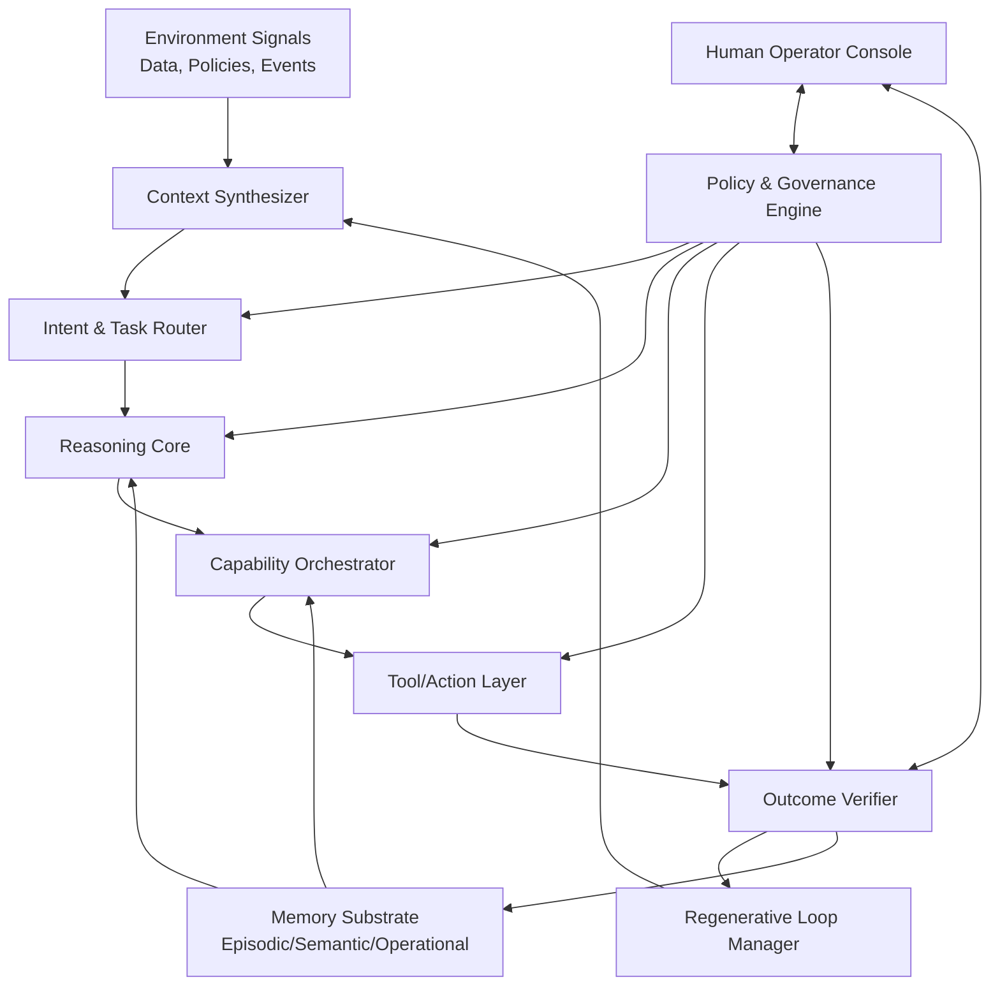
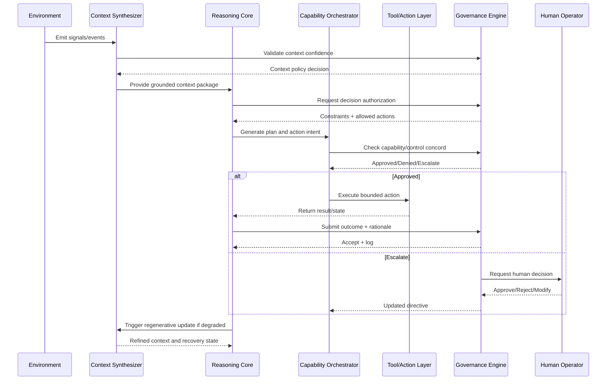

# Concord Architecture Diagram + Sequence Flow

## 1) Concord Reference Architecture (Mermaid)

## 2) Concord Sequence Flow (Mermaid)

## 3) Concord Control Checkpoints

1. **Cognitive checkpoint**: objective-policy consistency.
2. **Context checkpoint**: data quality and relevance confidence.
3. **Capability checkpoint**: tool readiness and action boundaries.
4. **Control checkpoint**: compliance, authority, and escalation trace.

## 4) Minimum Logging Requirements

- Decision intent hash
- Constraint set applied
- Action executed/blocked
- Outcome verification result
- Escalation path and final authority
- Recovery operations performed
